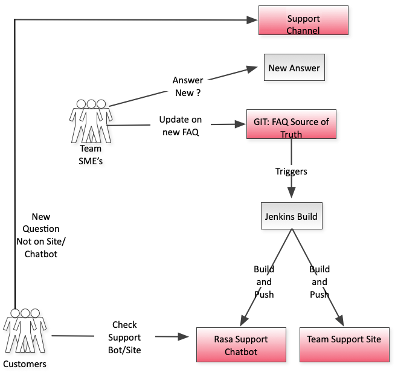

# Archived Repository

Thanks for your interest in Optum’s RasaUtilityTools project! Unfortunately, we have moved on and this project is no longer actively maintained or monitored by our Open Source Program Office. This copy is provided for reference only. Please fork the code if you are interested in further development. The project and all artifacts including code and documentation remain subject to use and reference under the terms and conditions of the open source license indicated. All copyrights reserved.

# Rasa FAQ Bot CICD

Rasa FAQ Bot CICD

## What it is about 

* Build an FAQ Support Chatbot
* Build FAQ page for a suppport site
* Automate the deployment of both
* Single source of truth for team to maintain FAQ

This repository is for an automated chatbot script that can be used to update both a team documentation support site FAQ and Rasa based support chatbot.  There will be one FAQ source of truth in the repository.  When updated, it will trigger a Jenkins build.  The Jenkins build will then update both the Rasa chatbot training files, build a new model, and activate that model.   It will also update the site support FAQ, so that both are kept in sync, and the support team only needs to maintain the FAQ in one place.

It was determined there was a need for this so that developers supporting an application or platform could have one source of truth for adding and updating FAQs.  This source of truth could then populate a Rasa chatbot and support website, and keep them in sync.

----------------
### Usage

The project has generic Rasa training files.  It is using Rasa 1.10.x. To use training data from an existing bot, put the training data into the correspoding Rasa training files without altering the order of the components for the script to work properly.  

The master FAQ file that will be used to generate both Rasa training data and the web page source is newfaq.md.  Each FAQ should have the following format:

### <main question>
intent: <rasa_intent_name>
answer: <answer>
altquestion: <alternate way to ask question for rasa NLU training data>
altquestion: <alternate way to ask question for rasa NLU training data>
altquestion: <alternate way to ask question for rasa NLU training data>
  
Once ran, the script will generate the necessary rasa training files, as well as a faq.mdx file that can be used for the support web site source.

The script can be ran locally with the instructions below.  A 'rasa train' would then also need to be done manually to generate the new Rasa model. The included jenkinsbuild file can be used to automate this process and upload the new model to a Rasa X instance, as well as trigger the web support site build.

#### Requirements

- Python3 (3.7)
- Rasa (Rasa 1.10.x)
- pandas (1.2.1)
- For a detailed list of the libraries used for the Jenkins Rasa build refer to the included requirements.txt

#### Running locally

python ./chatscriptStandalone.py

Our current setup utilizes Jenkins to automate the build.  The scripts and jenkinsfile are included here.  More information on integration git with Jenkins can be found here: https://www.jenkins.io/solutions/github/

#### The Pipeline

A generic Jenkinsfile is included in this repsoitory, look for values in "<>" that should be replaced with your own.

To run this, you should specify ./chatscriptJenkins.py in your Jenkinsfile. (As seen in the Jenkinsfile of this repo)

This works by creating a Python Jenkins workspace, where the chatbot script will be run to update your Rasa files. Then, using shell script, these values will be passed to the Rasa URL of your choice, as well as a GitHub repo (containing your FAQ) of your choice.

